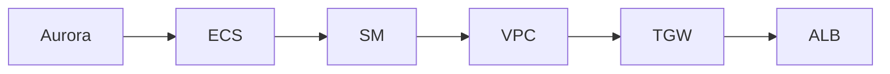

# InfraTales | AWS CDK Transit Gateway Multi-Environment VPC: Dev, Staging, Prod on One TGW

**AWS CDK (TYPESCRIPT) reference architecture — networking pillar | advanced level**

> You need to run truly isolated dev, staging, and prod environments for a latency-sensitive trading platform — each with its own VPC, database, and compute — but they still need controlled cross-environment routing and a single global entry point. Doing this manually means 3x the drift risk and 3x the on-call confusion when something breaks at 2am. The real pain is wiring Transit Gateway peering, Aurora Global Database failover, and Global Accelerator together in a way that doesn't quietly break your RPO when the primary region goes dark.

[](LICENSE)
[](CONTRIBUTING.md)
[](https://aws.amazon.com/)
[-IaC-purple.svg)](https://aws.amazon.com/cdk/)
[](https://infratales.com/aws-cdk-transit-gateway-multi-environment-vpc-pattern/)
[](https://infratales.com)


## 📋 Table of Contents

- [Overview](#-overview)
- [Architecture](#-architecture)
- [Key Design Decisions](#-key-design-decisions)
- [Getting Started](#-getting-started)
- [Deployment](#-deployment)
- [Docs](#-docs)
- [Full Guide](#-full-guide-on-infratales)
- [License](#-license)

---

## 🎯 Overview

The CDK TypeScript project provisions multiple environment-specific VPCs (dev/staging/prod) connected via a Transit Gateway for controlled inter-VPC routing without VPC peering mesh sprawl. Each environment runs ECS Fargate workloads behind an Application Load Balancer, with Aurora Global Database providing cross-region replication and Secrets Manager handling credential injection at runtime. AWS Global Accelerator sits in front of the primary ALB, providing anycast routing and static IPs as a single global ingress point. The non-obvious design choice is using SSM Parameter Store alongside Secrets Manager — SSM carries non-sensitive environment config that ECS task definitions need at deploy time, while Secrets Manager handles DB credentials with automatic rotation.

**Pillar:** NETWORKING — part of the [InfraTales AWS Reference Architecture series](https://infratales.com).
**Target audience:** advanced cloud and DevOps engineers building production AWS infrastructure.

---

## 🏗️ Architecture



> 📐 See [`diagrams/`](diagrams/) for full architecture, sequence, and data flow diagrams.

> Architecture diagrams in [`diagrams/`](diagrams/) show the full service topology (architecture, sequence, and data flow).
> The [`docs/architecture.md`](docs/architecture.md) file covers component responsibilities and data flow.

---

## 🔑 Key Design Decisions

- Aurora Global Database on a db.r6g.large with one replica adds roughly $400/month per region cluster compared to a single-region Aurora setup on the same instance class, but cuts RPO from hours (snapshot restore) to under 1 minute for cross-region replication lag [inferred]
- Transit Gateway charges $0.05/GB data processed plus hourly attachment fees per VPC — for low-traffic internal environments like dev, this costs more than VPC peering but eliminates the O(n²) peering mesh as environments grow [inferred]
- Global Accelerator runs at ~$18/month base plus $0.01/GB data transfer — justified for a trading platform where anycast routing and static IPs matter, but wasteful if you only need latency improvement for internal services [inferred]
- ECS Fargate removes EC2 fleet management overhead but makes burst cost unpredictable — a misconfigured task auto-scaling policy during a market open spike can triple compute costs within minutes with no natural ceiling [inferred]
- Sharing a single Transit Gateway across dev/staging/prod keeps the routing config DRY but means a misconfigured route table in dev can inadvertently open a path to prod subnets — environment isolation is a routing policy concern, not a hard network boundary [from-code]

> For the full reasoning behind each decision — cost models, alternatives considered, and what breaks at scale — see the **[Full Guide on InfraTales](https://infratales.com/aws-cdk-transit-gateway-multi-environment-vpc-pattern/)**.

---

## 🚀 Getting Started

### Prerequisites

```bash
node >= 18
npm >= 9
aws-cdk >= 2.x
AWS CLI configured with appropriate permissions
```

### Install

```bash
git clone https://github.com/InfraTales/<repo-name>.git
cd <repo-name>
npm install
```

### Bootstrap (first time per account/region)

```bash
cdk bootstrap aws://YOUR_ACCOUNT_ID/YOUR_REGION
```

---

## 📦 Deployment

```bash
# Review what will be created
cdk diff --context env=dev

# Deploy to dev
cdk deploy --context env=dev

# Deploy to production (requires broadening approval)
cdk deploy --context env=prod --require-approval broadening
```

> ⚠️ Always run `cdk diff` before deploying to production. Review all IAM and security group changes.

---

## 📂 Docs

| Document | Description |
|---|---|
| [Architecture](docs/architecture.md) | System design, component responsibilities, data flow |
| [Runbook](docs/runbook.md) | Operational runbook for on-call engineers |
| [Cost Model](docs/cost.md) | Cost breakdown by component and environment (₹) |
| [Security](docs/security.md) | Security controls, IAM boundaries, compliance notes |
| [Troubleshooting](docs/troubleshooting.md) | Common issues and fixes |

---

## 📖 Full Guide on InfraTales

This repo contains **sanitized reference code**. The full production guide covers:

- Complete AWS CDK (TYPESCRIPT) stack walkthrough with annotated code
- Step-by-step deployment sequence with validation checkpoints
- Edge cases and failure modes — what breaks in production and why
- Cost breakdown by component and environment
- Alternatives considered and the exact reasons they were ruled out
- Post-deploy validation checklist

**→ [Read the Full Production Guide on InfraTales](https://infratales.com/aws-cdk-transit-gateway-multi-environment-vpc-pattern/)**

---

## 🤝 Contributing

See [CONTRIBUTING.md](CONTRIBUTING.md) for guidelines. Issues and PRs welcome.

## 🔒 Security

See [SECURITY.md](SECURITY.md) for our security policy and how to report vulnerabilities responsibly.

## 📄 License

See [LICENSE](LICENSE) for terms. Source code is provided for reference and learning.

---

<p align="center">
  Built by <a href="https://www.rahulladumor.com">Rahul Ladumor</a> | <a href="https://infratales.com">InfraTales</a> — Production AWS Architecture for Engineers Who Build Real Systems
</p>
